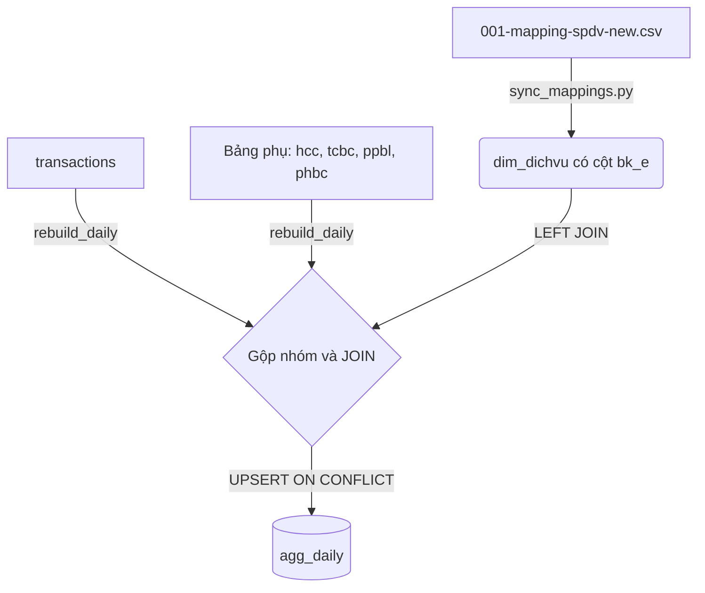

# Blueprint: Thiết kế Kỹ thuật Bảng `agg_daily` có cột `BK/E`

Bản thiết kế kiến trúc và mô tả chi tiết các thay đổi mã nguồn trong dự án Dashboard-BCCP.

---

## 1. Cấu Trúc Bảng Dữ Liệu Chi Tiết

### Bảng `dim_dichvu` (Danh mục dịch vụ) - Cập nhật thêm cột
*   Bổ sung cột `bk_e` (TEXT) để lưu trữ thông tin phân loại sản phẩm.
*   Cột `bk_e` nhận các giá trị: `BK`, `EMS`, `Đại lý QT`, `Khác` hoặc `Không phân loại`.

### Bảng `agg_daily` (Tổng hợp doanh thu cấp ngày) - Bảng mới
```sql
CREATE TABLE IF NOT EXISTS agg_daily (
    ngay           DATE    NOT NULL, -- Định dạng YYYY-MM-DD
    nam            INTEGER NOT NULL, -- Tiện ích lọc theo năm
    thang          INTEGER NOT NULL, -- Tiện ích lọc theo tháng
    ma_buu_cuc     TEXT    NOT NULL, -- Mã bưu cục 6 chữ số (hoặc mã cụm)
    nhom_dich_vu   TEXT    NOT NULL, -- Nhóm dịch vụ con (ví dụ: 'TMĐT', 'Truyền thống')
    bk_e           TEXT    NOT NULL, -- Loại dịch vụ phân loại ('BK', 'EMS', 'Đại lý QT', 'Khác', 'Không phân loại')
    tong_doanh_thu REAL    DEFAULT 0, -- Tổng doanh thu trước VAT
    tong_san_luong INTEGER DEFAULT 0, -- Tổng sản lượng bưu gửi
    so_kh_phat_sinh INTEGER DEFAULT 0, -- Số khách hàng phát sinh trong ngày
    PRIMARY KEY (ngay, ma_buu_cuc, nhom_dich_vu, bk_e)
);

-- Chỉ mục để tối ưu hóa truy xuất theo ngày và bưu cục
CREATE INDEX IF NOT EXISTS idx_agg_daily_date_bc ON agg_daily (ngay, ma_buu_cuc);
```

---

## 2. Luồng Dữ Liệu & Logic Xử Lý (ETL Dataflow)



### Chi tiết logic `rebuild_daily(conn, nam)`:
1.  **Xóa dữ liệu cũ**: Chạy lệnh `DELETE FROM agg_daily WHERE nam = ?` để dọn dẹp năm cần rebuild.
2.  **Logic phân loại và cảnh báo (Fallback & Warning Logic)**:
    *   Đối với các dịch vụ thuộc nhóm dịch vụ (`nhom_dich_vu`) là: **Truyền thống**, **TMĐT**, **Quốc tế**, hoặc **Chuyển phát HCC**:
        *   Nếu không tìm thấy mapping trong `dim_dichvu` hoặc cột `bk_e` bị NULL: Gán giá trị mặc định là `'Khác'`.
        *   Đồng thời in cảnh báo `[WARNING]` ra log hệ thống liệt kê các mã dịch vụ bị thiếu mapping để Sếp biết.
    *   Đối với các nhóm dịch vụ còn lại (ví dụ các dịch vụ phụ thuộc TCBC, PPBL, PHBC...):
        *   Tự động gán giá trị mặc định là `'Không phân loại'`.
        *   Không in cảnh báo ra log hệ thống.
3.  **Xử lý dữ liệu BCCP (từ bảng `transactions`)**:
    *   `LEFT JOIN dim_dichvu d ON t.ten_dich_vu = d.ma_dich_vu`
    *   Tính: `tong_doanh_thu = SUM(cuoc_tt_tong)`, `tong_san_luong = SUM(san_luong)`.
    *   Tính: `so_kh_phat_sinh = COUNT(DISTINCT CASE WHEN cms hợp lệ THEN cms END)`.
    *   Gộp theo: `ngay_chap_nhan`, `ma_buu_cuc`, `nhom_dich_vu`, `bk_e`.
4.  **Xử lý dữ liệu phụ (HCC, TCBC, PPBL, PHBC)**:

    *   Duyệt qua từng ngày trong năm (hoặc gộp trực tiếp theo chuỗi ngày phân rã của các bảng phụ).
    *   `LEFT JOIN dim_dichvu d ON t.ten_dich_vu = d.ma_dich_vu OR t.ten_dich_vu = d.ten_dich_vu`.
    *   Sử dụng cú pháp SQLite `UPSERT` (`INSERT ... ON CONFLICT(ngay, ma_buu_cuc, nhom_dich_vu, bk_e) DO UPDATE SET tong_doanh_thu = tong_doanh_thu + excluded.tong_doanh_thu, tong_san_luong = tong_san_luong + excluded.tong_san_luong`) để cộng dồn số liệu từ bảng phụ vào bảng `agg_daily` mà không làm đè lên dữ liệu BCCP đã nạp trước đó.
